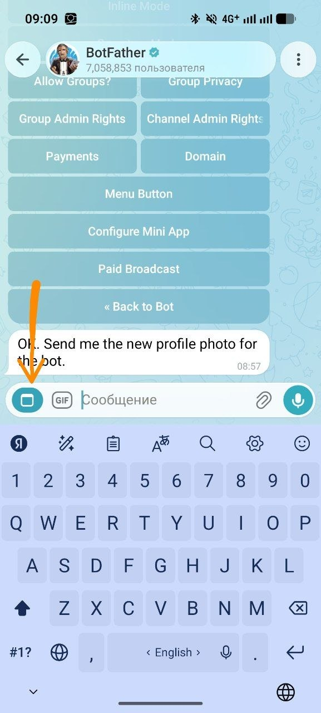
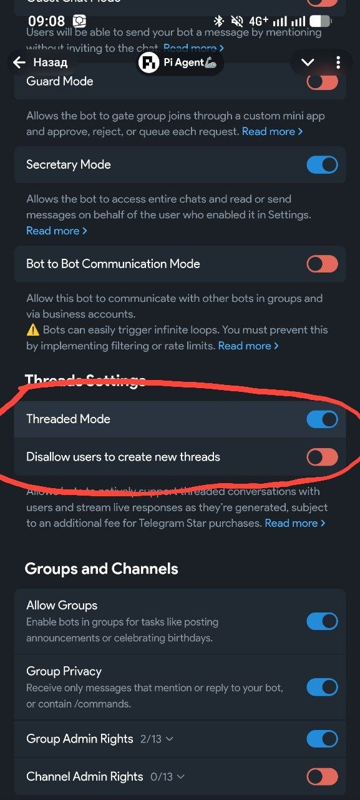
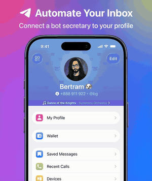

> ⚠️ Experimental. pi-telegram-manager is built **for local models** and, at runtime, is driven by one — a small local model (tested with [Qwen3.6-35B-A3B-UD-Q4_K_XL.gguf](https://huggingface.co/unsloth/Qwen3.6-35B-A3B-GGUF)) running through Pi. Cloud LLMs (such as Claude) take part in its development. It is maintained with AI assistance and may contain non-professional design choices, rough edges, broken behavior, or mistakes. Use it at your own risk.

# pi-telegram-manager

<p align="center">
  
</p>

<p align="center">
  <a href="https://www.npmjs.com/package/pi-telegram-manager"></a>
  <a href="https://github.com/m62624/pi-telegram-manager/actions/workflows/ci.yml"></a>
  <a href="SECURITY.md#verify-a-release-do-not-take-my-word-for-it"></a>
  <a href="LICENSE"></a>
</p>

An experimental [Pi](https://github.com/earendil-works/pi) extension that puts a Pi agent on Telegram — as your own assistant on your phone, and as a secretary that answers other people on your behalf. The model runs **on your machine, in your own Telegram account**.

> ⚖️ **Terms & responsibility — read before using.** The bot is **yours**, not this project's: you create it in @BotFather and connect it to Telegram, and Telegram's [Bot Developer Terms](https://telegram.org/tos/bot-developers) then bind **you** — *"'you' refers to you, the developer"*, and the Telegram account holding the bot's credentials answers for what it does. So they apply to running your own bot, not to reading this repository. Also: the [Privacy Policy](https://telegram.org/privacy) and the [Secretary / Business section](https://telegram.org/tos/bot-developers#5-4-telegram-business).
>
> In manager and mixed modes the bot reads chats with **other people** and answers **on your behalf**. It tells them what it is: it introduces itself as an AI assistant to anyone it has no history with, answers truthfully when asked whether it is a bot, and by default labels each message it sends (`manager.labeler`). The first two are bundled into its instructions and cannot be turned off by a setting — the banner can. **You alone are responsible** for how you use it and for the data it processes. The bot repeats these links on `/start` and `/help`.

The question behind it: **can a small local model be genuinely useful in everyday life if its context is managed carefully?** So the design starts from the local model, not a cloud one. Where other extensions assume a large cloud context and pour everything into it, this one **respects a small context window** — it was tuned for a local model at **131k** context. Almost every choice — one decision per turn ending in a tool call, strict per-chat context isolation, a last-N memory window, idle memory consolidation split into resumable fragments — exists to keep a small model coherent across many conversations without a huge prompt.

### What this deliberately is not

**One local model, one session. No sub-agents, no agent swarm, no orchestration layer** — a decision, not a gap waiting to be filled. Those tricks assume you can spend context and calls freely; a small local model cannot. So one model handles every chat, seeing exactly one conversation at a time.

Need the cloud shape — parallel agents, a big context, a delegation layer? **Fork it.** MIT, ports injected, and the pieces you would replace (context building, the scheduler, the memory passes) are the ones deliberately kept small. It runs on cloud models as-is; it is simply not tuned for them, and will not grow features that only make sense there.

---

## Install

Released versions, published to npm:

```bash
pi install npm:pi-telegram-manager
```

Developer version — the latest `main`, including changes not yet released to npm:

```bash
pi install git:github.com/m62624/pi-telegram-manager
```

Both channels can have bugs; the difference is only what they track — npm follows tagged releases, GitHub follows `main`. Then set it up: **[Getting started](#getting-started)**.

---

## Modes

One bot account, one mode at a time. Each mode is a different job for the same model.

### 🤖 Personal — your terminal session, on your phone

Binds your **current Pi terminal session** to your **private chat with the bot**. It is the same session, not a copy: what you type in Telegram arrives in the terminal, what you type in the terminal is mirrored to Telegram, and the model's answer appears in both.

- Send text, files and images; the bot saves non-image files to disk and hands the model real paths ([`files.downloadDir`](SETTINGS.md#files)), so it can open them with its normal tools.
- You see the model **work**, not just its conclusion: each message it writes is delivered as it finishes, and each tool call is mirrored as a collapsible block ([`assistant.toolActivity`](SETTINGS.md#assistant-personal-mode)).
- Replies arrive as native rich Markdown with a live "typing…" indicator and a streamed draft preview ([`assistant.draftPreviews`](SETTINGS.md#assistant-personal-mode)).
- Messages you send while it is busy are **queued**, not dropped; editing a queued message rewrites it in place.
- **Forwards** you paste in arrive as one turn, not one per message, and are capped by their own budget ([`forwards`](SETTINGS.md#forwards-forwarded-messages-all-modes)) — a wall of forwarded posts cannot eat the model's context, in your DM or in a chat the manager answers.
- The bot talks only to **you** (`allowedUserId`) and touches no other chats.

Start it with `/telegram-personal`. In the chat: `/clear` (wipe history), `/esc` (cancel the running turn), `/help`.

### 🕵️ Secretary manager — answer other people on your behalf

Through a Telegram **Secretary** connection (formerly called **Business**), the bot reads your conversations with **many different people** and decides, message by message, whether to reply **on your behalf**. One agent multiplexes every chat.

Start it with `/telegram-manager`. There is nothing to choose: the behaviour below is the whole mode.

#### The algorithm, in full

Every branch of this is enforced in **code**. The model is only ever asked the questions a machine cannot answer — *is this person actually waiting for an answer, and what should it say* — and it is never even offered the chance to answer you.

```
                   a message lands in a chat you manage
                                    │
                  ┌─────────────────┴─────────────────┐
              it is YOURS                       it is THEIRS
                  │                                   │
         ┌────────┴────────┐               ┌──────────┴──────────┐
    wake-word?         no wake-word    wake-word?           no wake-word
         │                 │                │                     │
         │            ✗ NO TURN             │              held 5 minutes
         │          you took this           │             (your first chance)
         │          batch yourself          │                     │
         │                                  │           ┌─────────┴─────────┐
         │                                  │       you answer         you stay
         │                                  │     ✗ dropped —            silent
         │                                  │       it never                │
         ▼                                  ▼       repeats you             ▼
    ✓ TURN NOW                         ✓ TURN NOW                      ✓ TURN
  (the one case it                  (skips the wait; the model
   answers YOU)                      still decides if it was
                                     really addressed)

  ─────────────────────────────────────────────────────────────────────────
  ✓ TURN  →  the model is given ONE chat and must end with ONE tool:
             manager_reply (answer)  ·  manager_silent (nothing was asked)
             then that chat keeps a 2:00 fast lane, so a live back-and-forth
             is not made to wait five minutes over again
```

**A message of yours also does three things**, none of which is "answer me":

1. **closes the 2:00 fast lane** in that chat — you are present, so the bot goes back to letting you answer first;
2. **holds any draft it was writing** right then: it is reconsidered against what you just said, and sent, refined, or dropped — never fired off over your head;
3. **and nothing else.** It does not switch the bot off in that chat: the next message from that person arms a new window, and if you let that one hang, the bot answers it.

**What that means in practice:**

- **It never replies immediately.** An incoming message is held for the owner-reply window ([`manager.ownerReplyWindowMs`](SETTINGS.md#manager-business-manager-and-the-telegram-side-of-mixed), default **5 min**): **you** get first crack, always. Only if the window runs out in your silence is the chat handed to the model. Want it to answer for you more eagerly? Shorten the window. Want it to almost never beat you to it? Lengthen it. That single number is the whole "how much do I delegate" dial.
- **It never answers *you*.** Your messages are context, never a task — no message of yours can open a turn at all. So writing *"did you buy the bread?"* to someone cannot make the bot answer *"yes"*: after a message of yours nothing in that chat is unanswered, and there is nothing for it to wake up for. This is structural, not a rule the model is asked to follow.
- **Writing in a chat does not switch the bot off in it.** You simply took that batch. If the person writes again and you let it hang, the window runs out and the bot answers — it keeps watching for whatever nobody answered. (There is no "freeze": you can half-follow a conversation without shutting the bot out of it.)
- **Call it and it comes.** A wake-word ([`manager.mentionWords`](SETTINGS.md#wake-words)) or the bot's own name skips the window — from the other person, and from **you**: *"hey qwen, what did I forward to them?"* is answered right there in that chat. It is the one case where a message of yours reaches the model, and whatever you add while it starts up (a screenshot, the forwards you were asking about) counts as part of your question, not as a cancellation of it.
- **It stays quiet when nothing is being asked.** "ok", "nice", a sticker, small talk between two other people — that judgement is the model's, and the chatter guard ([`manager.strictReplyGuard`](SETTINGS.md#manager-business-manager-and-the-telegram-side-of-mixed)) drops a reply it itself tagged as chatter unless it was addressed directly.
- **If you answer while it is writing, its reply is not sent blind.** The draft is held and reconsidered against what you just said: send it, refine it, or drop it. It never talks over you.

Everything else about the manager — how it orders chats, what it remembers, what it is not allowed to do — is in [**How the manager actually works**](#how-the-manager-actually-works) below.

### 🔀 Mixed — Personal **and** manager, in one session

Mixed is not a third behaviour: it is **both of the above on one brain** — your coding thread *and* the secretary. What makes it work is a queue with a strict priority: **you always outrank other people.**

- **While you are working, other people wait.** Their messages are stored and deferred; **nothing of theirs enters your context** or costs you tokens, and even a wake-word does not pull the model off your work — it only marks that chat as ready. Contacts never bleed into your code.
- **You are you on either surface.** The terminal and the `personal` topic of your bot DM are the same session and rank exactly the same, so answering from your phone is not "the Telegram side".
- **When you go quiet, it goes back to Telegram.** After [`mixed.returnToTelegramMs`](SETTINGS.md#mixed-mixed-mode) (default **8 min**) of idleness — counted from when the model's inference *finishes*, not while it thinks — it moderates whoever is waiting, under exactly the manager rules above.
- **When you come back, you take the brain instantly.** A prompt from you aborts a moderation turn in flight. Nothing is lost: an unanswered chat is picked up next time, an interrupted memory pass resumes where it stopped.
- **The two sides stay separate.** What the bot writes to other people goes to them; the account of what it did lands in the **manager** topic. While it moderates it runs in the sandbox (messaging tools only) — your full `read`/`write`/`bash` exist only while you hold the terminal. Your TUI stays clean: one footer line (`mixed · coding`) says who holds the brain.

Start it with `/telegram-mixed`.

### ⏹️ Switching modes

In the terminal, the mode commands **are** the switcher: `/telegram-personal`, `/telegram-manager`, `/telegram-mixed`, `/telegram-stop`. Starting one stops whatever else was running — you never have to stop by hand. Switching is a **priority** action: it aborts whatever the bot is doing (even a long memory consolidation) and takes effect at once.

Away from the terminal, send **`/switch`** in your DM with the bot and pick **Manager / Mixed / Personal** from an inline keyboard. It has **no Stop button** on purpose — a Secretary connection is a long-lived thing, and a mistap while picking a mode should not end it. Stopping from Telegram is its own explicit command: **`/stop`**.

A **pinned message** in the `personal` topic always shows the active mode.

---

## How the manager actually works

The decision rules are in [the algorithm above](#the-algorithm-in-full). This is everything around them: the order chats are served in, what the model sees, and what it is not allowed to do. Every number is a setting — the links go to [SETTINGS.md](SETTINGS.md).

### One chat at a time, in a deliberate order

Messages from many people arrive at once; the model handles **one chat per turn**, so it is never confused about who it is talking to. The scheduler picks the next chat by:

1. **never-replied chats first** — someone who has not heard back yet outranks an ongoing conversation;
2. then a **continuation window** ([`manager.continueWindowMs`](SETTINGS.md#manager-business-manager-and-the-telegram-side-of-mixed), default **2:00**) — right after replying, that chat keeps its fast lane, so a live back-and-forth is not made to wait five minutes again, nor interrupted by an older chat. **Writing in the chat yourself closes that lane**: you are present, so the bot goes back to letting you answer first.

### Wake-words — how the bot knows it is being addressed

[`manager.mentionWords`](SETTINGS.md#wake-words) (default `["llm", "manager"]`, plus your bot's own label automatically). A message containing one jumps straight past the owner-reply window — but it does **not** force a reply: the model still decides whether the word was a real address to it ("hey llm, what do you think?") or just a word used in passing ("the LLM at work is slow").

Being addressed **in substance** works too ("what does the bot think?") — but only from the other person, because only their messages ever reach the model. For **you**, the wake-word list is the trigger; that is the price of the guarantee that the bot cannot answer a message of yours by accident. Add the words you actually use. In mixed mode, no wake-word ever preempts your coding.

### What it sees, and what it remembers

- **Strict per-chat isolation.** Each turn the model's context is rebuilt from disk for that one conversation. It never sees another chat.
- **A last-N window** ([`manager.rememberMessages`](SETTINGS.md#manager-business-manager-and-the-telegram-side-of-mixed), default **20**), bounded again by characters ([`manager.maxContextChars`](SETTINGS.md#manager-business-manager-and-the-telegram-side-of-mixed) / [`manager.maxCharsPerMessage`](SETTINGS.md#manager-business-manager-and-the-telegram-side-of-mixed)) so one long paste cannot overflow a small local context.
- **Durable facts per contact** ([`manager.factsLimit`](SETTINGS.md#manager-business-manager-and-the-telegram-side-of-mixed), default **20**), keyed by the person's Telegram account (not their name — so two Alexes never merge). They are resurfaced the next time that person writes.
- **Memory consolidation.** When a chat has been quiet for [`manager.factConsolidationQuietMs`](SETTINGS.md#manager-business-manager-and-the-telegram-side-of-mixed) (default **30 min**), the model re-reads it and interrogates itself about what is worth keeping: *who is this person → which facts did they state → is each one actually true and durable* (up to [`manager.verifyLimit`](SETTINGS.md#manager-business-manager-and-the-telegram-side-of-mixed) facts). It runs only while idle, and a live message **interrupts it immediately** — the pass resumes later from where it stopped.

### Guards against a small model doing something silly

- **Every turn ends in a tool call**, never in prose. Prose is never delivered to Telegram — if the model writes an answer as plain text, it is **held as a draft** and handed back with one instruction: send it, refine it, or drop it. That way a composed answer is never lost, and never sent by accident.
- **The same happens when new messages land mid-reply**: the draft is held and reconsidered against them, up to [`manager.reviseThreshold`](SETTINGS.md#manager-business-manager-and-the-telegram-side-of-mixed) times (default **2**), then sent as-is.
- **The chatter guard** ([`manager.strictReplyGuard`](SETTINGS.md#manager-business-manager-and-the-telegram-side-of-mixed), default **on**): a reply the model itself tagged as chatter/acknowledgement — or as not needing an answer — is dropped unless the interlocutor addressed the bot directly. This is what stops a weak model from cheerfully joining a conversation between two other people.
- **Backlog is not "woken"** ([`manager.liveFreshnessMs`](SETTINGS.md#manager-business-manager-and-the-telegram-side-of-mixed), default **10 min**): after a reconnect Telegram redelivers what the bot missed, so a message is judged by its *true send time* — anything older is kept as context but starts no reply cycle, and a conversation that ended yesterday cannot wake the bot. A message delayed in transit still counts as live, which is why this sits well above the owner window.
- **Catch-up on start** ([`manager.catchUpWindowMs`](SETTINGS.md#manager-business-manager-and-the-telegram-side-of-mixed), default **10 h**): when a mode starts, chats whose last message is not yours and is still recent get answered — so switching the bot on does not silently ignore what waited for it.
- **Re-greeting** ([`manager.reopenAfterMs`](SETTINGS.md#manager-business-manager-and-the-telegram-side-of-mixed), default **24 h**): a conversation resuming after a long silence is greeted rather than continued mid-sentence.
- **The sandbox.** While the manager holds the session the model has **no computer access** — only its messaging tools. It cannot read your files, run commands, or ask you anything, and a blocked call steers it back. Extra tools can be allowed explicitly ([`manager.allowedTools`](SETTINGS.md#manager-business-manager-and-the-telegram-side-of-mixed)).

### What you see

With [`manager.log`](SETTINGS.md#manager-business-manager-and-the-telegram-side-of-mixed) on (the default), every turn is mirrored to the **manager** topic of your bot DM: which chat, the model's thinking, the tools it called, the decision it made and why it stayed silent. That is your audit trail — read it for a day before trusting the bot with your chats.

---

## Security model

The idea is simple: **a model can only do harm through its tools.** So when it talks to other people, it gets none — except the ones it needs to talk.

**In Personal, everything is open.** It is your own conversation: the model reads, writes, runs commands, opens the files you send it. It works for you.

**As a manager, it can only reply.** Answering other people, it runs in the **telegram-sandbox**: its tool list is rewritten to the messaging tools and nothing else, and any other call is blocked at runtime — hiding a tool is not enough, a small model happily invents a name it remembers. It can look at **images** people send ([`manager.media.images`](SETTINGS.md#manager-business-manager-and-the-telegram-side-of-mixed), default on) — but not files: documents are refused, and it has no tool to open one anyway.

**In mixed it switches by itself:** your own chat with the bot (terminal or the `personal` topic) → full tools; a message from someone else → sandbox. Same predicate everywhere, so the gate cannot drift out of sync.

**But it is not a container.** No Docker, no VM, no separate user — the Pi process runs with your own rights the whole time. The sandbox gates the *model*, not the process. And [`manager.allowedTools`](SETTINGS.md#manager-business-manager-and-the-telegram-side-of-mixed) lets you hand tools back into it: whatever you put there, a stranger's message can eventually reach. Empty is the default.

## Getting started

### 1. Create the bot (BotFather)

In Telegram, open [@BotFather](https://t.me/BotFather), send `/newbot`, and follow the prompts. BotFather replies with an **HTTP API token** (`123456:ABC-…`) — this is your `botToken`.

### 2. Enable Secretary Mode — for manager and mixed modes

Their Telegram side receives messages through a Telegram **Secretary** connection (the feature Telegram **recently renamed from Business** — the Bot API is unchanged), which a bot can only accept when **Secretary Mode** is on for it. One-time BotFather toggle:

> `@BotFather` → `/mybots` → *select your bot* → **Bot Settings** → **Secretary Mode** (formerly **Business Mode**) → **Turn on**

Personal mode does not need it.

> ✅ **No Telegram Premium, subscription, or "business account" is required.** Telegram opened **connected secretary/business bots to everyone** — [Bot API 10.0](https://core.telegram.org/bots/api-changelog), **8 May 2026**: *"Allowed Business Bots to manage user accounts without a Telegram Premium subscription."* An ordinary free account can let a bot reply on its behalf, and the people who message you need nothing either.

### 3. Enable Threaded Mode — required

Your DM with the bot is **two topics**, split by *whose* conversation it is: **personal** (you and the model — your prompts, its replies, and the full trace of the tool calls it made for you) and **manager** (what the bot did for other people — the per-turn feed and runtime notices). Without them both streams share one chat: every moderation card, every notice and your own conversation interleaved — which makes the DM useless as either. The bot creates both topics itself; it only needs the toggle:

> `@BotFather` → open the **Mini App** (tap the menu button next to the message field) → *select your bot* → **Threaded Mode** → **on**

⚠️ It is **not** in the classic `/mybots` → **Bot Settings** keyboard — that menu has no such row. The toggle lives only in the newer BotFather Mini App, under **Thread Settings**. `getMe` then reports `has_topics_enabled: true`, which is exactly what this extension checks.

| Open the Mini App | Turn on Threaded Mode |
| --- | --- |
|  |  |

*Not rendering? Open them in the repository: [`assets/threaded-mode-1-open-mini-app.jpg`](assets/threaded-mode-1-open-mini-app.jpg), [`assets/threaded-mode-2-toggle.jpg`](assets/threaded-mode-2-toggle.jpg).*

Leave **Disallow users to create new threads** off — the extension creates the `personal` and `manager` topics itself, and you may want your own besides. They are safe to keep: the bot **never deletes a topic you made**, and it only ever removes the ones it created (see [below](#why-the-personal-topic-is-new-every-session)). A message you write in a topic of your own is **copied** into `personal` so the conversation there stays whole, and the original is left exactly where you put it. Only the "All" view is different — nothing lives there, so a message typed in it is *moved*, not copied.

Turn the switch **on** if you would rather the DM held nothing but the bot's own topics; you then cannot create or delete topics there at all — including, usefully, not deleting `personal` by accident.

If the toggle is off, the bot does not die — it falls back to one flat DM — but it **tells you so**, in that DM, with a link back to this section, on every mode start. Silence it only by deciding: either turn Threaded Mode on, or say you meant it with `topics.enabled: false` (then also consider `manager.log: false`, since the feed is chatty in a single stream).

Mute the **manager** topic by hand if you don't want its notifications — Telegram gives bots no API for that. Rename the topics with [`topics.personalName` / `topics.managerName`](SETTINGS.md#topics-owner-dm-layout).

### 4. Find your Telegram user id

`allowedUserId` is your **numeric** user id (not your @username) — the only account the bot obeys. Get it from a lookup bot such as [@userinfobot](https://t.me/userinfobot) or [@getidsbot](https://t.me/getidsbot).

### 5. Configure

Create `<pi-agent-dir>/extensions/pi-telegram-manager/settings.json` (typically `~/.pi/agent/extensions/pi-telegram-manager/settings.json`):

```json
{
  "botToken": "123456:ABC-your-bot-token",
  "allowedUserId": 123456789,
  "manager": { "ownerName": "Alex" }
}
```

`botToken` may instead be `"env:TELEGRAM_BOT_TOKEN"` to read it from the environment. Every other key is optional — see **[SETTINGS.md](SETTINGS.md)**.

### 6. (Manager / mixed only) Connect the bot to your account

The toggle in step 2 only *allows* the bot to be connected; this is where you actually hand it your chats. Open Telegram **Settings → Telegram Business / Secretary → Chatbots** (Telegram is rolling out the *Secretary* label), enter your bot's username, and choose which chats it may access — and make sure it is allowed to **reply** (without that permission the bot can read but not answer, and the manager will sit there silent).



*Not rendering? Open it in the repository: [`assets/connect-secretary-bot.gif`](assets/connect-secretary-bot.gif).*

Then open Pi and start a mode.

---

## Commands

**In the Pi terminal:**

| Command | Purpose |
| --- | --- |
| `/telegram-personal` | Start **Personal** mode (bind this session to your DM) |
| `/telegram-manager` | Start the **secretary manager** (answer other people for you) |
| `/telegram-mixed` | Start **mixed** mode — terminal + Telegram in one session |
| `/telegram-stop` | Stop whichever mode is active |
| `/telegram-status` | Show the active mode |

**In your chat with the bot:** `/start` (privacy & terms — anyone), `/switch` (mode picker — owner), `/stop` (stop the bot — owner), `/help`; in Personal mode also `/clear`, `/esc`.

---

## Settings

Everything is one JSON file at `<pi-agent-dir>/extensions/pi-telegram-manager/settings.json`. Every key is optional and layered over the defaults; unknown keys warn, wrong-typed values fail loudly. The timings default for a **local model** answering over minutes, not milliseconds.

**Every key, with its default: [SETTINGS.md](SETTINGS.md).**

---

## Why the `personal` topic is new every session

Start a mode and you get a **fresh `personal` topic**; the one you were using is renamed to **`personal (archive)`**, and the archive before it is deleted. So the DM holds at most two: the live conversation and the last one. A session where you never wrote anything leaves nothing behind — its topic is deleted, creation notice and all, and it does not push a real conversation out of the archive.

That is not a filing preference. It is the only defence we have against a bug we could not otherwise survive.

A topic can stop accepting ordinary messages **from the phone**. You open it in Telegram for Android, you type, the app shows your message inside the topic — and it is not there. Telegram posted it *outside* the topics, into the general chat. The bot receives it with **no `message_thread_id`** at all, which is indistinguishable from a message you deliberately typed in the "All" view. Meanwhile Telegram Desktop, in the same topic, on the same account, behaves perfectly: `message_thread_id` set, `is_topic_message: true`, message where it belongs. And a *reply* from the same phone lands inside the topic, because a reply names its target explicitly.

We measured it rather than guessed: the same text, from the same phone, into a topic created minutes earlier and into one that was three days old (and had survived a rename and a deleted chat). The new topic took it. The old one did not.

There is no signal for this. Nothing in the API says a topic has gone that way, and "no thread id" cannot be read as "the topic is broken" — it is also the perfectly normal shape of a message typed outside the topics. So the bot does not try to detect it. It simply never keeps a topic long enough for it to happen: **one session, one topic.** Your history is not lost — it is one chip to the left, in `personal (archive)`.

If you use the bot only from Telegram Desktop, none of this affects you; the rotation is harmless there.

---

## Development

```bash
git clone https://github.com/m62624/pi-telegram-manager.git
cd pi-telegram-manager
npm install
npm test          # vitest (all tests + mocks live in tests/)
npm run check     # biome
npm run build     # tsc (typecheck)
npm run ci        # check + build + test + pack --dry-run
pi -e ./src/index.ts
```

---

## Provenance, forks, and who answers for what

The bot answers real people on your behalf, so it matters that you can tell the
real thing from something wearing its name.

**Where it is published from.** Two places, both mine:
[npm](https://www.npmjs.com/package/pi-telegram-manager) and
[github.com/m62624/pi-telegram-manager](https://github.com/m62624/pi-telegram-manager)
(mirrored to [tangled](https://tangled.org/m62624.tngl.sh/pi-telegram-manager)).
Releases are built by GitHub Actions and published with npm **trusted publishing**,
which attaches a signed [provenance attestation](https://docs.npmjs.com/generating-provenance-statements)
binding the tarball to the commit it was built from — `npm audit signatures` checks
it. A package that cannot show provenance pointing at this repository was not built
here, whatever its README says.

**What the code guarantees.** Two behaviours are bundled into the instructions and
reachable by no setting: the manager introduces itself as an AI assistant to anyone
it has no history with, and it answers truthfully when asked whether it is a bot.
The block that says so is appended after your own instruction files, so your text
cannot outweigh it. Everything else — tone, name, banner, subjects — is yours to
configure.

**What a fork can do, and what it cannot.** MIT means anyone may fork this, delete
that block, and ship the result. That is the deal, and I would not change it. But a
fork is not this project: I cannot vouch for one, patch one, or answer for one.
Whoever strips the disclosure and points a bot at real people is the person who did
that — and under Telegram's [Bot Developer Terms](https://telegram.org/tos/bot-developers)
the developer is *"you"*: the account that holds the bot's credentials. Running a
bot honestly is a choice each operator makes on their own machine. This one is built
to make the honest choice the easy one.

See [SECURITY.md](SECURITY.md) for how to report a vulnerability and how to verify a
release.

---

## License

[MIT](https://github.com/m62624/pi-telegram-manager/blob/main/LICENSE)
